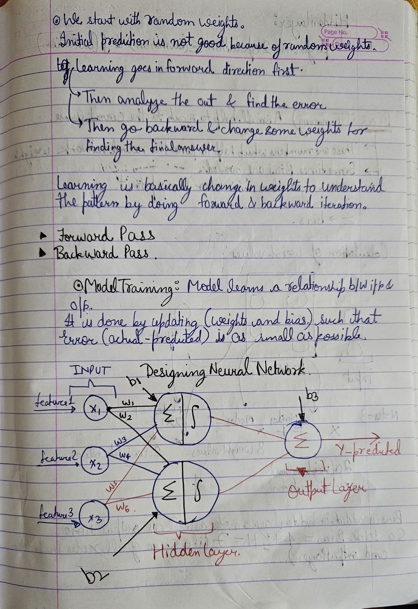

# AI: ( Artificial Intelligence )
<pre> 
1. AI is the System where it takes feedback and calculate based on data and become better to make decision next time.
2. Whenever reasoning and intelligence is merged then it become AI.
3. The more complex the system is that can be termed or called as AI.
</pre>

># Applications Of AI:
> Applications is so vast used in all the fields some of them are :  
> Healthcare   Automation   Home Automation Automobile  Vehicles.
<pre>
<h1>MACHINE LEARNING:</h1>
1. An Approach to achieve Artificial Intelligence.
2. A subfield of AI that aims to teach computers the ability to learn instead of explicitly programming every rule.
3.It uses the numerical and statistical approach to make decision.
<h1>Deep Learning:</h1>
1. it is also a subfield of AI.
2.It involves multi-layer(2+) artificial intelligence neural network.
3.It is a part of machine learning which uses the neural network to make decisions.
</pre>
> Descriptive  and infrential statistics.(upperlimit);

Image classification ==> using supervised learning.

Penalty and reward ==> penalize if things are not correct And reward if the word done is correct.

Agent  The object which is going to perform the task.
Environment  The environment where action will be taken.

Action : The work done by agent.

> More the data better is the AI system its totally wrong.

Machine learning algorithms learns till the threshold value and then the learning curve is constant.

 
 

<h1>Does Accuracy defines the AI system is better or not?</h1>
>Before moving to this let's learn about: 
<h1 style="font-size:60px; color:red;" >Confusion Matrix</h1>

 What is confusion matrix? 

it is a 2D matrix which tells about how much correct predictions and incorrect predictions does the model did in the data

 This help to find <ol> <li>Accuracy</li> <li>Precision</li><li>Specificity</li> <li>Recall</li></ol>

<h1 style="color:red; font-size:40px">
Deep Learning
</h1>

> 
it is also a subfield of AI. 
> It involves multi-layer(2+) artificial intelligence neural network. 
> It is a part of machine learning which uses the neural network to make decisions.

# Z-value:
> This is a linear summation function.
>( compressed form of data [ There was multiple inputs but according to weights now the data is cleaned up])
> Now, This is passed to activation function

# NLP :
## Vectorization of words in NLP:
> Frequency Embedding -- used to find the semantic meaning of the sentences or data. 
> or what word would come after one another.
> it takes so much memory so we need resourses to perform this.

-- Get all the unique words
-- A matrix is made out of these words 
-- (like confusion matrix , co-relation matrix)

### Characterstic Embedding

Encoder(BERT)
Bidirectional encoded representation transformers  --------- Decoder(Response)